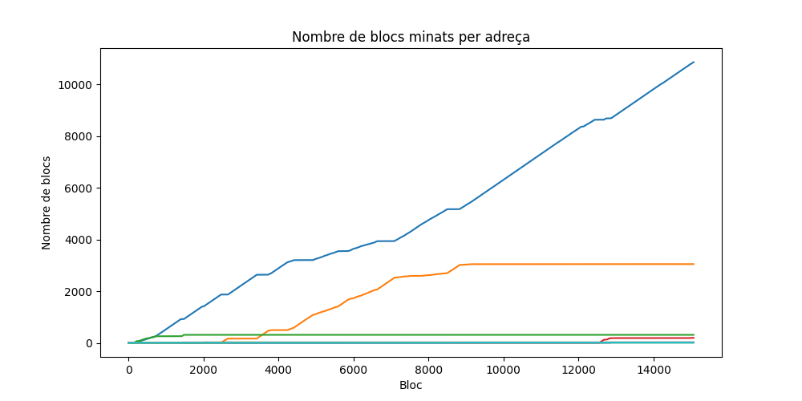
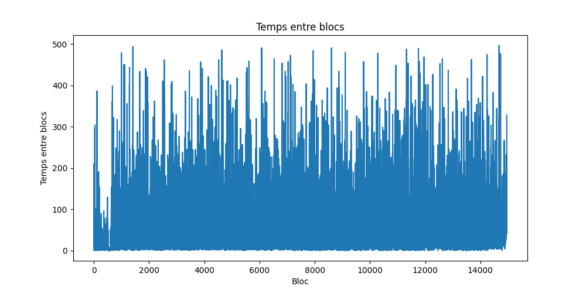

# Cripto_Explorer
This repository contains a Python script designed to get data from a small blockchain created for educational purposes. 
The script sends HTTP requests infinitely in order to mine new blocks, stores the information of each new mined block 
in a CSV file, and updates graphs showing the evolution of the blockchain.

